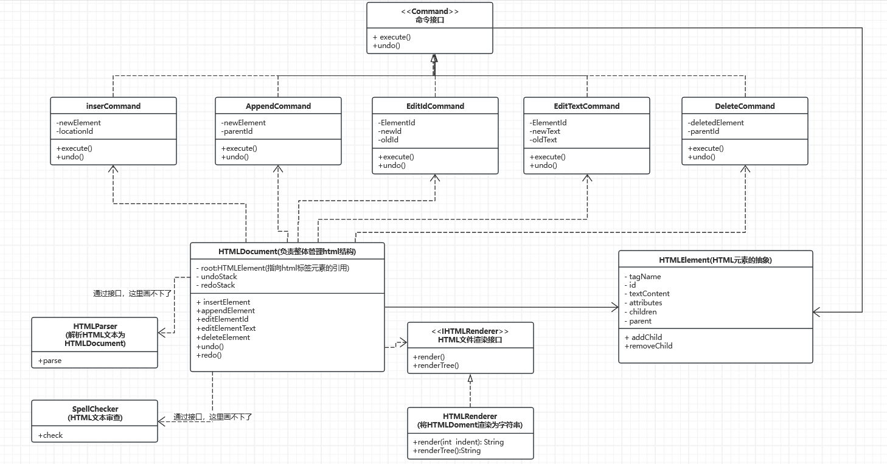

# Advanced-Software-Development-Technology

Tips：

1、Lab1的代码基于JAVA11，如果需要更改成JAVA8等，请修改pom.xml中的properties文件，但修改后请尽量不要上传。

2、target文件夹可以不用管，是JAVA在运行时自动生成的，如果遇到报错信息在target文件夹中，可以将target文件夹直接删除，然后重新运行。

编写代码时，请参照下列类图来编写：

各个文件的作用：

**constant/ErrorMessageEnum：**

存储错误代码及报错信息，使用方法可以借鉴HTMLElementOperationServiceImpl中的内容

**domain/HTMLElement：**

存储HTML信息

**domian/HTMLDocument：**

在HTMLElement基础上进行封装，并提供增删改查等操作

**service/HTMLElementOperationService：**

提供增删改查的接口

**service/impl/HTMLElementOperationServiceImpl：**

具体实现增删改查等操作

**Main.java：**

对输入命令进行处理，并调用不同的方法

**test/java/*.java：**

对增删改查等操作进行测试（基本都是GPT生成的测试用例）

pom.xml：

提供依赖，lab1所需的依赖基本都已经加进去了，如果有需要，可以自己添加

